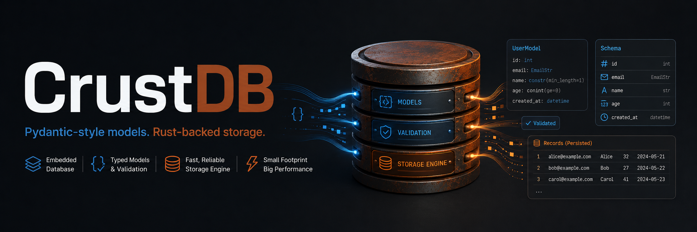

# CrustDB

CrustDB is a Python-first embedded database backed by a Rust storage engine.

The public API is intentionally small and model-based: define fields on a Python class, register the model, then use `insert`, `find`, `update`, and `delete` through `db.ModelName`.

## Features

CrustDB provides:

- Python model declarations with `Int` and `String` fields.
- Required fields, defaults, integer ranges, and type validation.
- `id=True` and `unique=True` constraints.
- Insert, exact-match find, update, and delete.
- Rust-owned persistence through `manifest.crust`, `schema.crust`, and `tables/*.tbl`.
- Stable internal row IDs.
- Page-based B-tree exact-match index files for `id=True` and `unique=True` fields.
- Dirty/missing/corrupt index recovery by rebuilding from table logs.

The native Rust/PyO3 engine is the default. A JSON development engine is available only when explicitly requested with `engine="json"`.

## Pydantic-Inspired Behavior

CrustDB models are Python classes that become persisted database schemas.

```python
class User(Model):
    id = Int(id=True)
    username = String(unique=True)
    age = Int(range=(0, 120), default=18)
```

Implemented today:

- `Model` classes define database schemas.
- `Int(...)` and `String(...)` declare typed fields.
- `id=True` marks a unique indexed identity field.
- `unique=True` enforces persisted database uniqueness.
- `required=True/False` controls missing-value validation.
- `default=...` fills missing values.
- `range=(min, max)` validates integer bounds.
- Returned rows support `row.username`, `row["username"]`, and `row.to_dict()`.
- Persisted schemas are locked: incompatible model changes are rejected on reopen.

CrustDB differs from plain Pydantic because some validation is database-aware. For example, `unique=True` is checked against persisted rows and backed by indexes.

Partially present but not enforced yet:

- `frozen=True` is stored on the model, but returned rows are not made immutable yet.

Desired later:

```python
class User(Model, frozen=True):
    id = Int(id=True)
    username = String(unique=True)
    age = Int(range=(0, 120))
```

Not implemented yet:

- Frozen row enforcement.
- Custom validators.
- Schema migrations.
- More field types like `Bool`, `Float`, and `DateTime`.
- Rust derive-style model API.

## Quick Example

```python
from crustdb import CrustDB, Int, Model, String


class User(Model):
    id = Int(id=True)
    username = String(unique=True)
    age = Int(range=(0, 120))


db = CrustDB("app.crustdb")
db.register(User)

user = db.User.find(id=1)
if user is None:
    user = db.User.insert(id=1, username="alice", age=25)

print(user.username)

updated = db.User.update(where={"id": 1}, values={"age": 26})
deleted = db.User.delete(id=1)
```

## Setup

This project uses `uv` for Python commands. No `pip install ...` flow is needed for normal development.

```powershell
uv sync
$env:Path = "$env:USERPROFILE\.cargo\bin;$env:Path"
uv run --with maturin maturin develop
```

Then verify both the Python API and Rust core:

```powershell
uv run pytest
cargo test
uv run python examples/basic.py
```

If the native module has not been built, `CrustDB("app.crustdb")` raises a clear setup error. For development-only JSON storage, opt in explicitly:

```python
db = CrustDB("app.crustdb", engine="json")
```

## API Surface

### Define A Model

```python
class User(Model):
    id = Int(id=True)
    username = String(unique=True)
    age = Int(range=(0, 120), default=18)
```

### Open A Database

```python
db = CrustDB("app.crustdb")
db.register(User)
```

`CrustDB("app.crustdb")` uses the native Rust engine. `CrustDB("app.crustdb", engine="json")` uses the development JSON engine explicitly.

### Insert

```python
row = db.User.insert(id=1, username="alice", age=25)
```

### Find

```python
row = db.User.find(id=1)
row = db.User.find(username="alice")
```

Find currently supports exact-match filters. Indexed single-field filters use the exact index when possible; other filters scan live rows.

### Update

```python
row = db.User.update(
    where={"id": 1},
    values={"age": 26},
)
```

`update` returns the updated row, or `None` when no matching row exists.

### Delete

```python
deleted = db.User.delete(id=1)
```

`delete` returns `True` when a row was deleted and `False` when no matching row exists.

## Runtime Data Layout

With the native Rust engine, `CrustDB("app.crustdb")` creates:

```text
app.crustdb/
|-- manifest.crust
|   # Storage format marker.
|
|-- schema.crust
|   # Encoded model and field metadata.
|
|-- tables/
|   |-- User.tbl
|       # Operation log with INSERT, UPDATE, and DELETE entries.
|
|-- indexes/
    |-- manifest.crustix
    |   # Tracks whether persisted indexes are clean or dirty.
    |
    |-- User/
        |-- id.idx
        |   # Page-based B-tree exact-match index for User.id.
        |
        |-- username.idx
            # Page-based B-tree exact-match index for User.username.
```

When explicitly opened with `engine="json"`, CrustDB uses simple JSON files:

```text
app.crustdb/
|-- schema.json
|-- User.json
```

The JSON engine exists so the Python API remains usable during early development and targeted tests. It is never selected silently. The intended database engine is the Rust path.

## Project Structure

```text
crates/crustdb_core/
  Rust database core: schemas, validation, storage files, row IDs, indexes.

crates/crustdb_py/
  PyO3 module exposing the Rust engine to Python as crustdb._native.

python/crustdb/
  Public Python package: model fields, CrustDB, Table, Row, engine adapter.

tests/
  Python API tests.

examples/basic.py
  Small smoke test for the public API.
```

For a file-by-file map, see `SPEC.md`.

## Development Commands

```powershell
uv sync
$env:Path = "$env:USERPROFILE\.cargo\bin;$env:Path"
uv run --with maturin maturin develop
uv run pytest
cargo test
uv run python examples/basic.py
```
